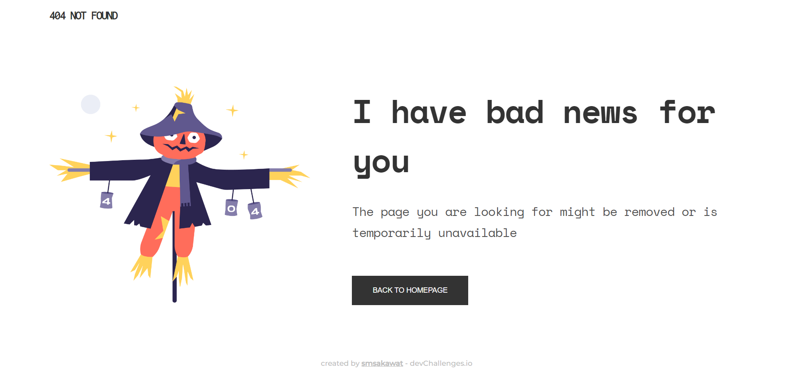

<h1 align="center">404 Not Found Page</h1>

   Solution for the "404-not-found" from <a href="http://devchallenges.io" target="_blank">Devchallenges.io</a>.

  <h3>
    <a href="https://404-dc.netlify.app/">
      Demo
    </a>
     | 
    <a href="https://github.com/smsakawat/designs/tree/main/404-not-found-dc">
      Solution
    </a>
     | 
    <a href="https://devchallenges.io/challenges/wBunSb7FPrIepJZAg0sY">
      Challenge
    </a>
  </h3>

## Overview

### Demo

Live demo of the solution [here](https://404-dc.netlify.app/).
