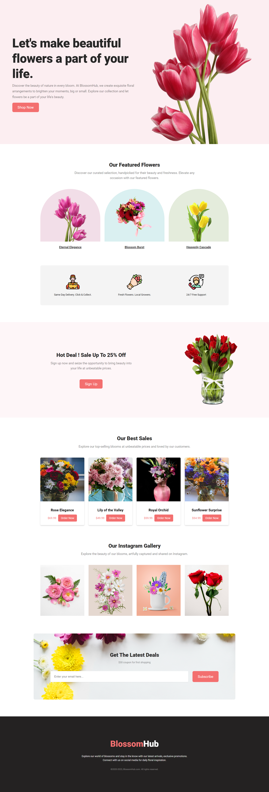

# Blossom Hub - Flower Shop Landing Page

## Overview

Blossom Hub is a beautiful and responsive landing page designed to showcase the elegance of various flowers.

You can view the live website here: [Blossom Hub Live Demo](https://blossomhub.netlify.app/)

## Table of Contents

- [Overview](#overview)
- [Technologies Used](#technologies-used)
- [Contact](#contact)

## Technologies Used

This project was built using the following technologies:

- HTML5
- CSS3

## Contact

If you have any questions, feedback, or just want to say hello, feel free to reach out:

- GitHub: [@smsakawat](https://github.com/smsakawat)
- LinkedIn: [@sakawat](https://www.linkedin.com/in/sakawat/)
- Twitter: [@sakawathossain\_](https://twitter.com/sakawathossain_)

Thank you for visiting Blossom Hub - your source of floral inspiration!
