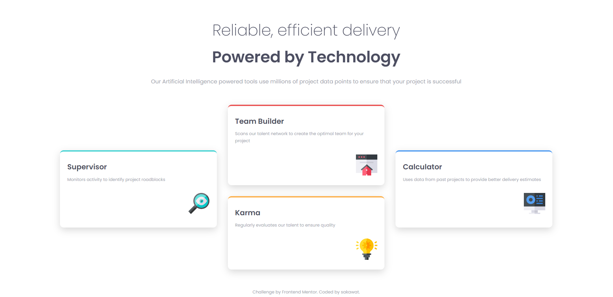

# Four Card Feature Section

This project is a solution to the [Four Card Feature Section challenge on Frontend Mentor](https://www.frontendmentor.io/challenges/four-card-feature-section-weK1eFYK). Frontend Mentor challenges help you improve your coding skills by building realistic projects.

## Overview

### The Challenge

The challenge was to create a responsive Four Card Feature Section that allows users to view the optimal layout for the site depending on their device's screen size.

### Demo

- [Live Site](https://fm-fcfs.netlify.app/)
- [GitHub Repository](https://github.com/smsakawat/designs/tree/main/fm-fcfs)

