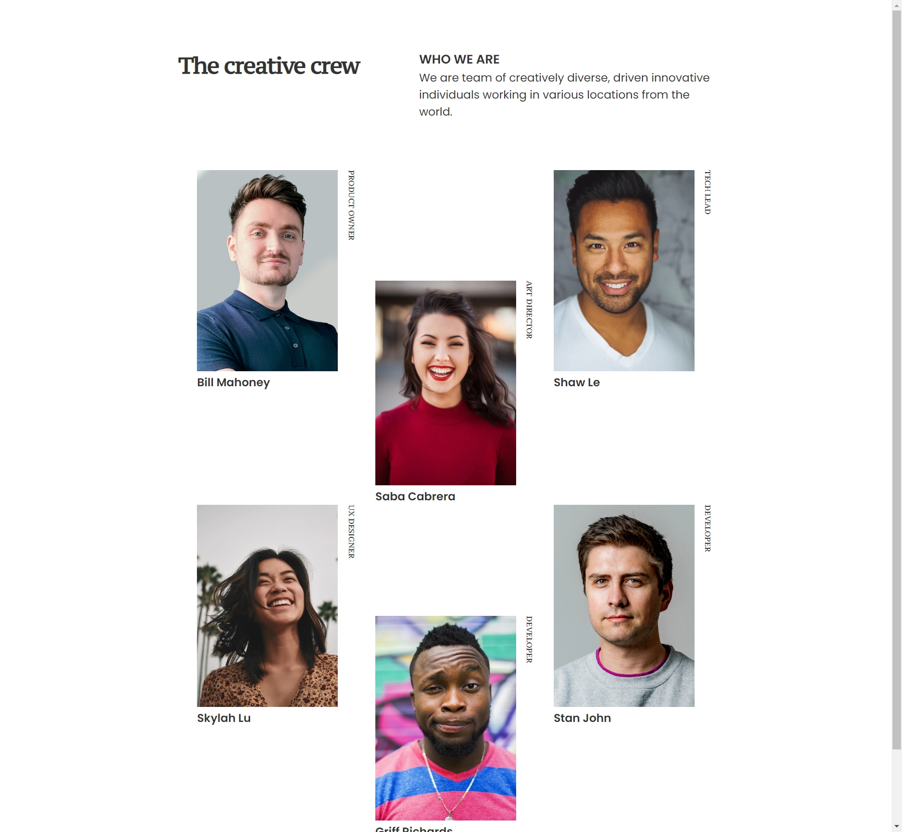

<h1 align="center">My Team Page</h1>

   Solution for the "My-Team" challenge from <a href="https://devchallenges.io/challenges/hhmesazsqgKXrTkYkt0U" target="_blank">DevChallenges</a>.

  <h3>
    <a href="https://my-team-page-dc.netlify.app/">
      Live Demo
    </a>
     | 
    <a href="https://github.com/smsakawat/designs/tree/main/my-team">
      Code
    </a>
     | 
    <a href="https://devchallenges.io/challenges/hhmesazsqgKXrTkYkt0U">
      Challenge
    </a>
  </h3>

## Overview

### Live Demo

Live demo of the project [here](https://my-team-page-dc.netlify.app/).
